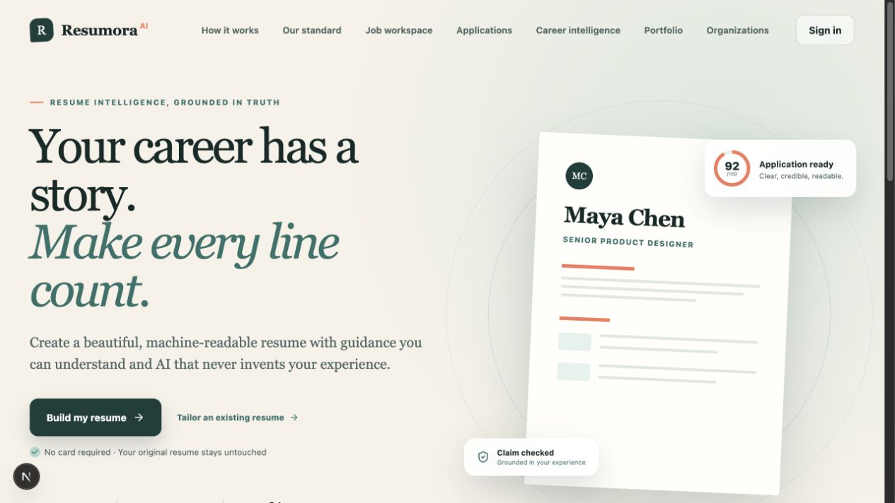
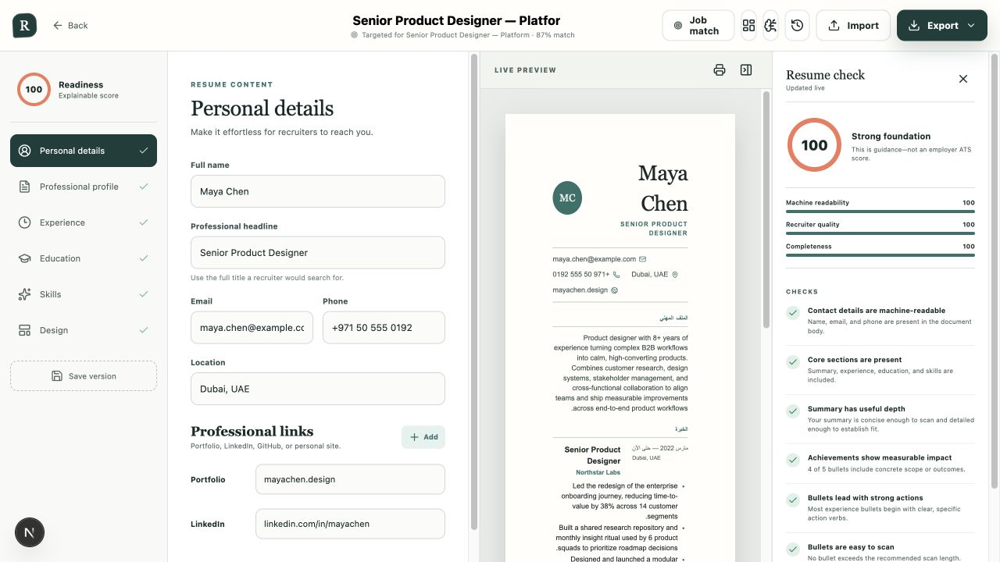
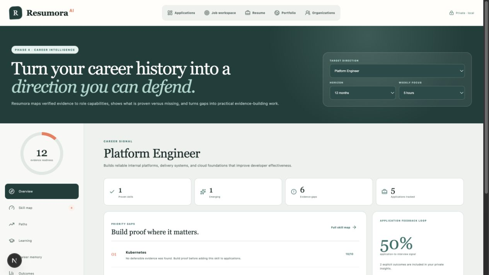
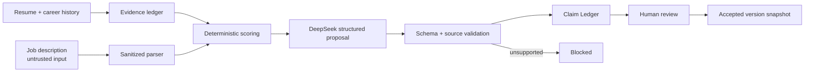
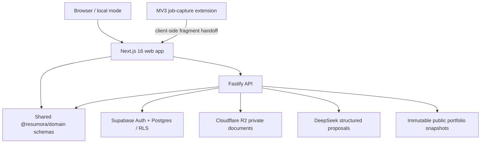

# Resumora AI

> **Truthful resumes. Clearer opportunities.** Resumora is a career-intelligence workspace that turns verified experience into machine-readable resumes, evidence-grounded applications, explainable role readiness, and defensible next steps.

[](https://resumora-ai-web.vercel.app/)

<p align="center">
  <a href="https://resumora-ai-web.vercel.app/"><strong>Live product</strong></a>
  ·
  <a href="./docs/resumora-user-handbook.html"><strong>Visual user handbook</strong></a>
  ·
  <a href="#product-proof">Product proof</a>
  ·
  <a href="#truth-preserving-ai-boundary">Trust model</a>
  ·
  <a href="./docs/architecture.md">Architecture</a>
  ·
  <a href="#run-it-locally">Quick start</a>
</p>

<p align="center">
  
  
  
  
  
  
  
</p>

## Resumora in 30 seconds

Most AI resume tools optimize language first and ask whether the result is true later. Resumora reverses that order: evidence is product data, every suggestion is a proposal, and the original document remains intact until a person accepts a supported change.

- **Verified before generated** — Career Vault records and source IDs ground suggestions in real experience.
- **Proposals, not silent mutations** — AI output arrives as a reviewable diff; it cannot directly rewrite the canonical resume.
- **Explainable signals** — readiness and job-match scores expose their components instead of pretending to be an employer's ATS score.
- **Useful before sign-up** — local mode keeps the core builder available without provider credentials; authenticated users can sync securely.

## Product proof

### A structured resume studio with visible reasoning



The editor keeps content, layout, readiness feedback, and a semantic preview in one workspace. Version snapshots preserve lineage while five machine-readable templates keep presentation separate from the canonical document model.

| Workspace | What it does |
| --- | --- |
| **Resume Studio** | Structured editing, live preview, localization, version history, PDF and DOCX export |
| **Career Vault + Claim Ledger** | Stores verified evidence, tracks source IDs, and blocks unsupported claims |
| **Job Workspace** | Treats job descriptions as untrusted input, then compares them with evidence-backed history |
| **Application Pipeline** | Tracks roles, stages, activity, materials, and outcomes in one lifecycle |
| **Career Intelligence** | Surfaces role readiness, skill states, evidence gaps, and practical next actions |
| **Interview Coach** | Builds preparation prompts from the target role and evidence the candidate can defend |
| **Portfolio Studio** | Publishes consent-based snapshots without exposing the private working document |
| **Organizations** | Adds scoped collaboration and participant-controlled visibility for teams and programs |

### Career direction you can defend



Career Intelligence uses a versioned, O*NET-aligned role graph and deterministic signals to turn career history into an auditable plan—without reducing a person to an opaque embedding.

## Truth-preserving AI boundary



The model never writes directly to the canonical document. Server-side prompts receive only the evidence IDs allowed for the task; structured responses are validated before they reach the Claim Ledger, and unsupported claims cannot be accepted.

## System architecture



| Engineering concern | Implementation |
| --- | --- |
| **Domain integrity** | Shared Zod schemas, deterministic scoring, immutable snapshots, and explicit version lineage |
| **AI safety** | Untrusted job-input boundary, evidence source IDs, structured responses, and unsupported-claim blocking |
| **Privacy** | Row-level security, hashed review tokens, short-lived R2 URLs, retention controls, and consent scopes |
| **Document quality** | Semantic screen rendering, selectable-text PDFs, and native DOCX paragraphs |
| **Full-stack scope** | Resume building, applications, interviews, intelligence, publishing, organizations, and a browser extension |
| **Resilience** | Local-first guest state plus authenticated synchronization and provider-aware fallbacks |
| **Verification** | Domain tests, type checks, linting, production builds, and integration-contract checks |

## Trust boundaries that matter

- **Job descriptions are data, not instructions.** Imported content is sanitized before it can influence an AI request.
- **Review links are capability tokens.** They are random, stored as hashes, revocable, and can expire.
- **Documents remain private by default.** Object access uses namespaced keys and short-lived signed URLs.
- **Exports stay usable outside Resumora.** PDF output retains selectable text; DOCX output uses native paragraphs.
- **Publishing is deliberate.** Public portfolios use immutable, consent-based snapshots rather than the private working state.
- **Multilingual by design.** The document model supports six languages, including right-to-left layouts.

## Repository map

```text
ResumoraAI/
├── apps/
│   ├── web/           # Next.js product UI, exports, portfolios, and review views
│   ├── api/           # Fastify API, auth, storage, imports, and AI orchestration
│   └── extension/     # Manifest V3 job-capture extension
├── packages/domain/   # Canonical schemas, scoring logic, and domain tests
├── supabase/          # RLS-aware database migrations
└── docs/              # Architecture, trust boundaries, and implementation notes
```

- [`apps/web`](./apps/web) — product interface and document rendering
- [`apps/api`](./apps/api) — server boundary and provider integrations
- [`packages/domain`](./packages/domain) — shared source of truth
- [`apps/extension`](./apps/extension) — privacy-conscious job capture
- [`supabase/migrations`](./supabase/migrations) — database evolution and access policies
- [`docs/architecture.md`](./docs/architecture.md) — deeper system design and security notes

## Run it locally

### Prerequisites

- Node.js 22+
- npm

```bash
git clone https://github.com/captain-jack-sparrow909/ResumoraAI.git
cd ResumoraAI
cp .env.example .env
npm install
npm run dev
```

Open the web app at `http://localhost:3000`. The API health endpoint is available at `http://localhost:4000/health`.

The core product works in local mode without Supabase, DeepSeek, or R2 credentials. Add provider values to `.env` when you want authentication, synchronization, private document storage, and server-side AI proposals.

## Verify the workspace

```bash
npm run typecheck
npm run lint
npm test
npm run build
npm run check:integrations
```

## Deployment model

- **Web:** `apps/web` on Vercel
- **API:** `apps/api` on Render or another Node-compatible service
- **Data and auth:** Supabase Postgres with row-level security
- **Private files:** Cloudflare R2 through signed URLs
- **AI:** a configurable DeepSeek model behind the API boundary

See [the architecture guide](./docs/architecture.md) for environment contracts, retention behavior, collaboration rules, scoring semantics, export guarantees, and the current Career Intelligence implementation.

---

Built by [Jabir Khan](https://jabir-khan.vercel.app/) as an exploration of a harder question than “Can AI improve this sentence?”: **Can career software help people communicate their value without inventing it?**
